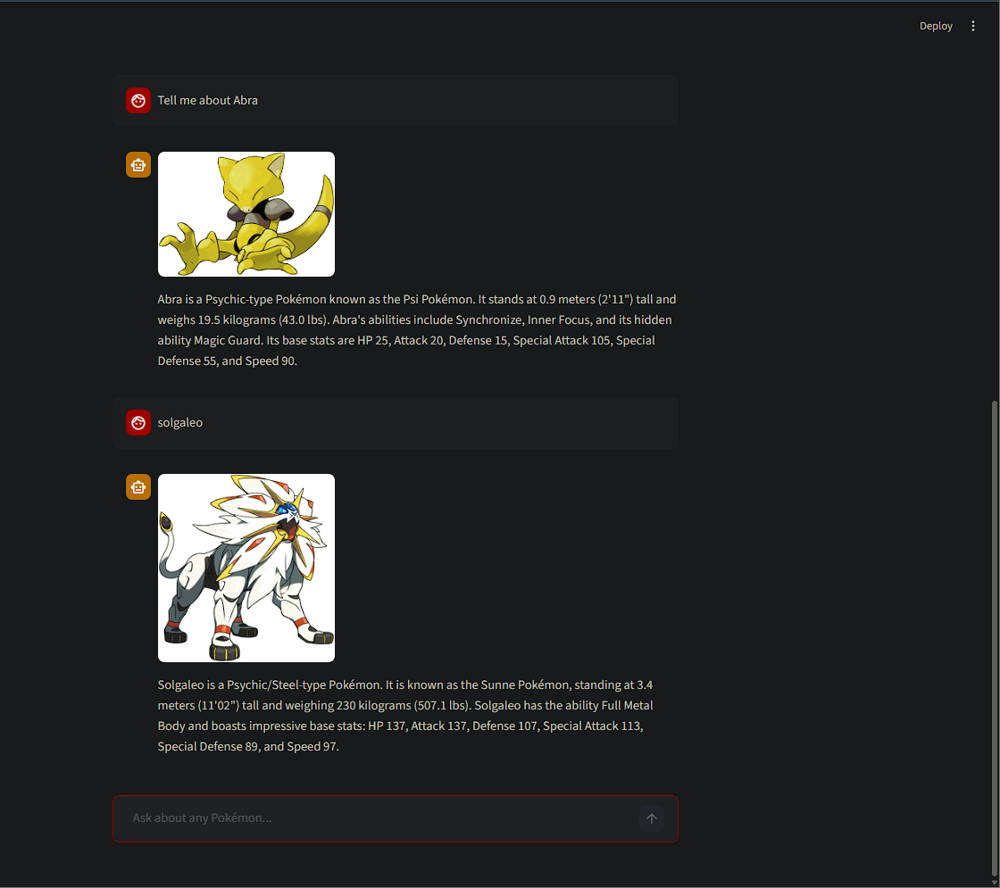
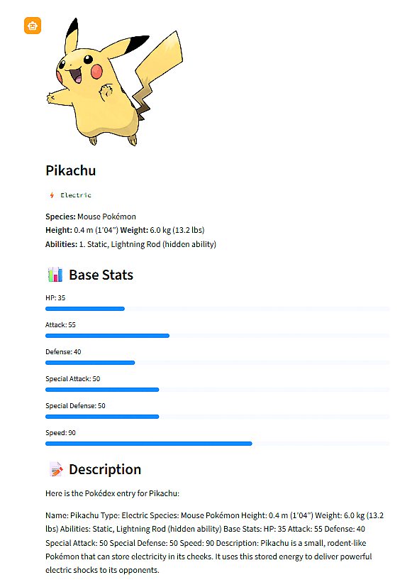
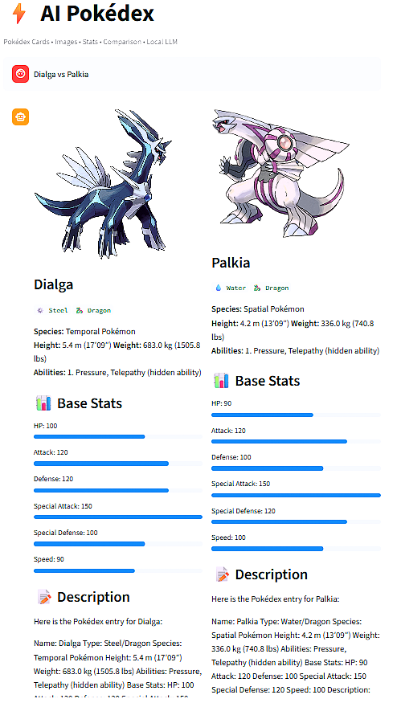

# 📘 AI Pokédex – RAG-Powered Pokémon Assistant

An **AI-powered Pokédex** that lets users explore Pokémon information using **natural language queries**, powered by **Retrieval-Augmented Generation (RAG)** and a **local LLM**.

This project is **fully CPU-friendly**, does **not require a GPU**, and runs completely **offline** using Ollama.

---

## 🚀 Screenshots

### 🖥️ ChatGPT-Style Pokédex UI


---

### 📋 Pokédex Card View


---

### 🔄 Pokémon Comparison


---

## 🧠 What This Project Does

- 🔍 Answer Pokémon queries in **natural language**
- 🧠 Uses **RAG (FAISS + embeddings)** for factual accuracy
- 🤖 Generates descriptions using a **local LLM (Ollama)**
- 🖼️ Displays Pokémon images
- 📊 Shows Pokédex-style stat cards
- 🔄 Supports Pokémon comparisons (e.g., *Dialga vs Palkia*)

---

## ✨ Key Features

### ✅ Natural Language Chat
Ask things like:
- `Tell me about Pikachu`
- `What type is Solgaleo?`
- `Dialga vs Palkia`

---

### 🧠 Retrieval-Augmented Generation (RAG)
- FAISS vector search
- Sentence-Transformer embeddings
- Ensures answers are grounded in Pokémon data

---

### 📊 Pokédex Cards
Each Pokémon card includes:
- Image
- Type badges
- Height & weight
- Abilities
- Base stats
- AI-generated description

---

### 🔄 Pokémon Comparison
- Side-by-side Pokémon analysis
- Stats & type comparison
- Ideal for battle insights

---

### 💻 CPU-Only & Offline
- No GPU required
- Runs locally using Ollama
- Optimized for low-end systems

---

## 🏗️ Architecture Overview
```
        User
         ↓
  Streamlit Chat UI
         ↓
  FastAPI Backend
         ↓
 RAG Engine (FAISS)
         ↓
 Pokémon Dataset (CSV)
         ↓
  Local LLM (Ollama)
```
---

## ⚙️ Installation & Setup

### 1️⃣ Clone Repository
```bash
git clone https://github.com/<your-username>/ai-pokedex.git
cd ai-pokedex

🗂️ Project Structure

ai-pokedex/
├── backend/
│ └── app/
│ ├── services/
│ │ ├── rag_engine.py
│ │ ├── pokedex_parser.py
│ │ ├── name_extractor.py
│ │ ├── image_resolver.py
│ │ └── llm.py
│ └── main.py
├── frontend/
│ └── streamlit_app.py
├── data/
│ ├── pokemon.csv
│ └── images/
├── scripts/
├── screenshots/
│ ├── chat_ui.png
│ ├── pokedex_card.png
│ └── comparison.png
├── requirements.txt
├── .gitignore
└── README.md

---
Create Virtual Environment
python -m venv venv
venv\Scripts\activate

Install Dependencies
pip install -r requirements.txt

Install Ollama & Model

Download Ollama from https://ollama.com

ollama pull phi3
# or
ollama pull llama3:8b

Run Backend
uvicorn backend.app.main:app --reload

Run Frontend
streamlit run frontend/streamlit_app.py


Open http://localhost:8501
```
🧪 Example Queries
- hello
- Tell me about Abra
- Pikachu vs Raichu
- What are Solgaleo's abilities?
```
```
🧰 Tech Stack

- Python
- FastAPI
- Streamlit
- FAISS
- SentenceTransformers
- Ollama (Local LLM)
- Pandas
- NumPy

##👨‍💻 Author

- Ankush Maity
- B.Tech CSE
- AI / ML Enthusiast
- GitHub: [@Amsir390](https://github.com/Amsir390)

🌟 Why This Project Stands Out

- Real-world RAG implementation

- Local LLM (no API cost)

- Industry-ready architecture

- Strong portfolio and interview project

⭐ Support

- If you like this project, give it a star on GitHub!

